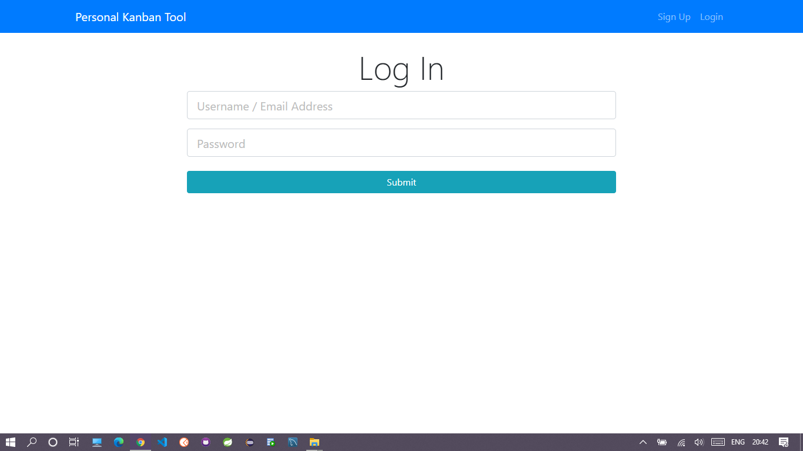
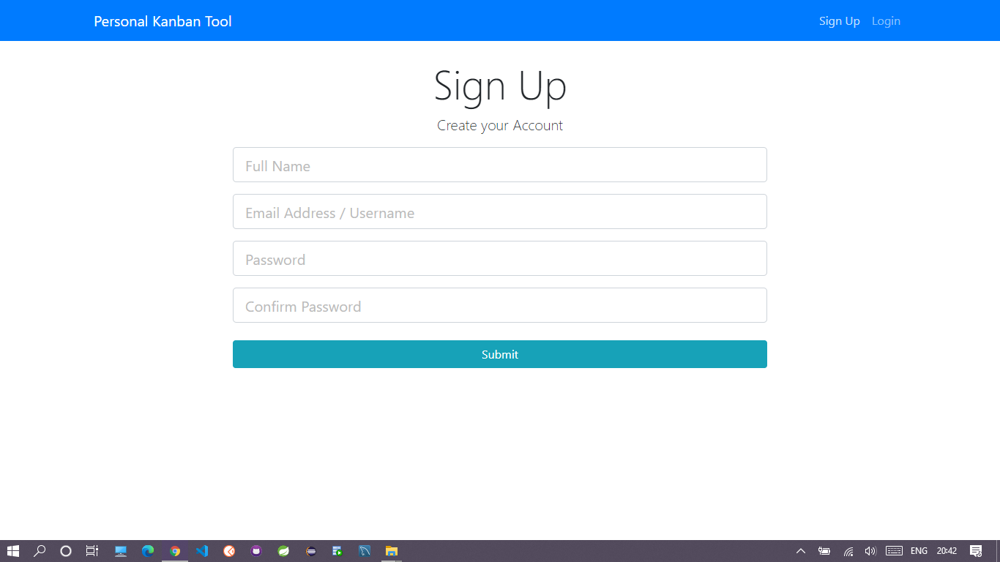
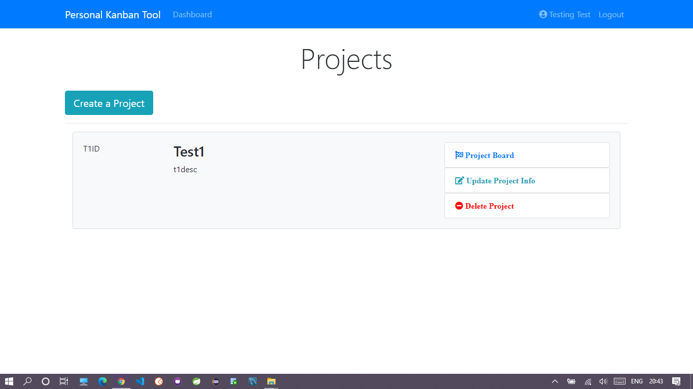
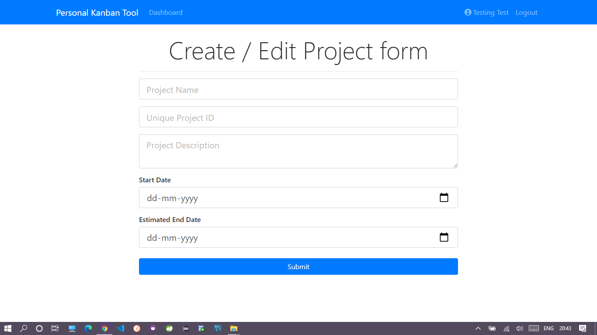
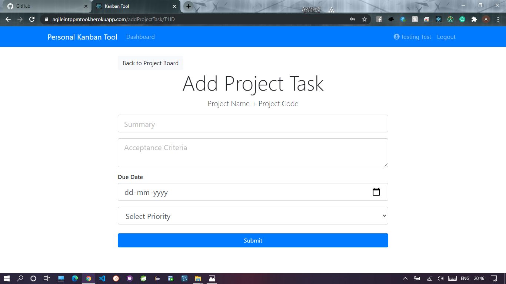
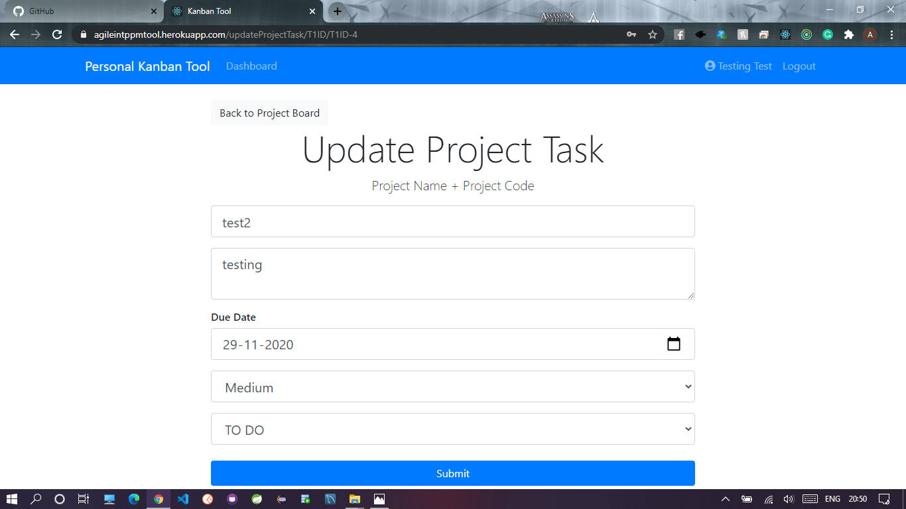
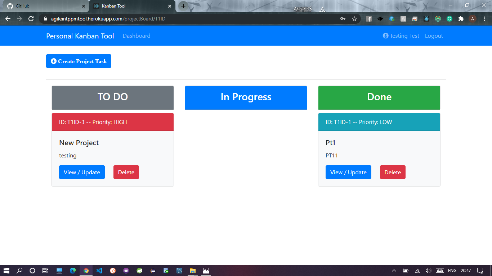
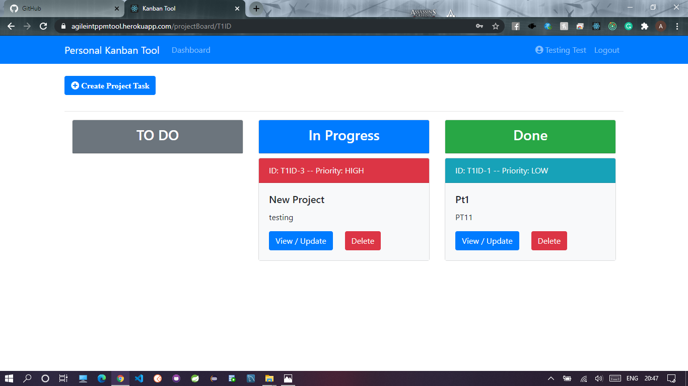
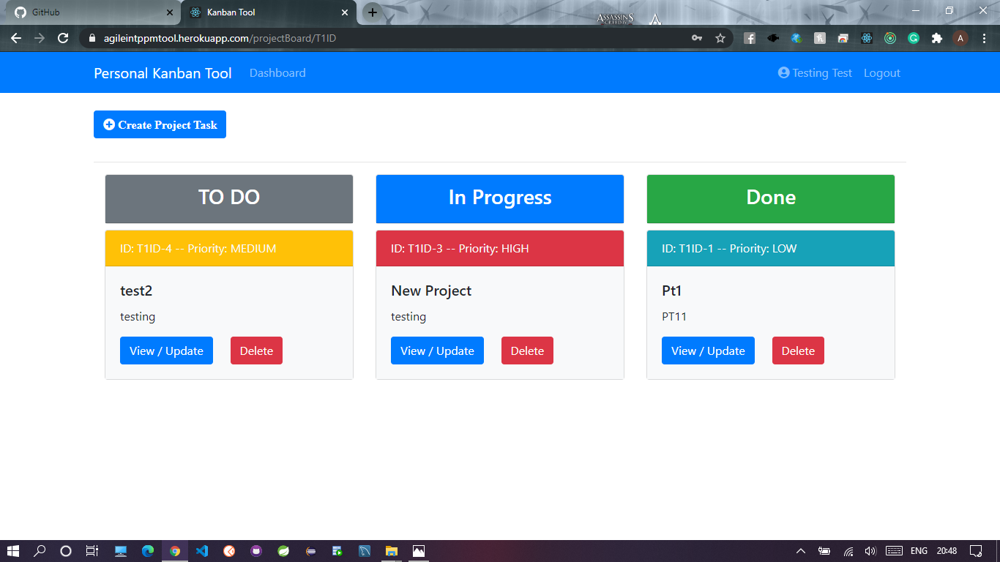
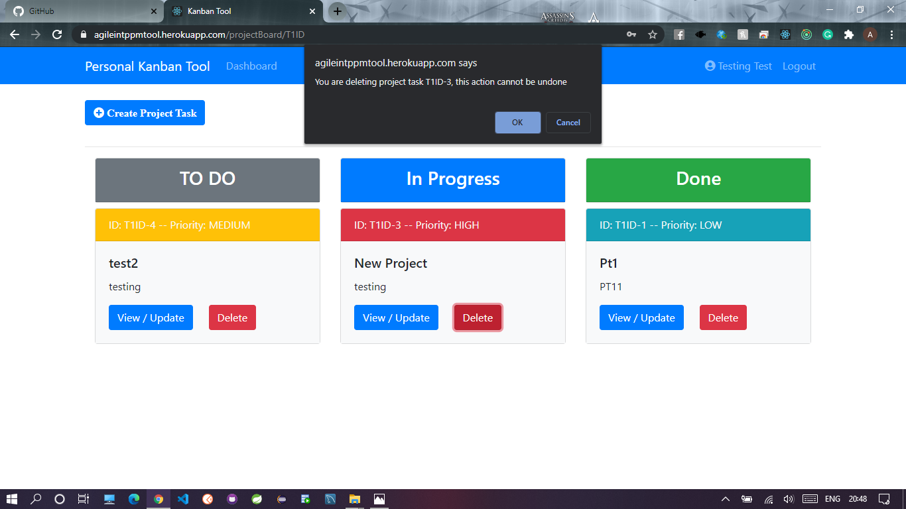

# ppm-tool

## Overview:
-Project Management Tool 
-Managing projects can be difficult for managers
-This tool can be used to effectively manage the projects for project owners or scrum masters.

## Technologies Used
- Spring Boot
- Spring Security
- React.js
- Redux.js
- Bootstrap
- CSS
- HTML

## Features
- Login/Signup
- Adding new projects
- view project board
- creating new projects
- updating new projects
- deleting projects
- adding project tasks
- setting priority of project tasks(High/medium/low)
- setting status of project tasks(todo/in-progress/done)
- updating project tasks
- deleting project tasks
- logout

## Some Screenshots

